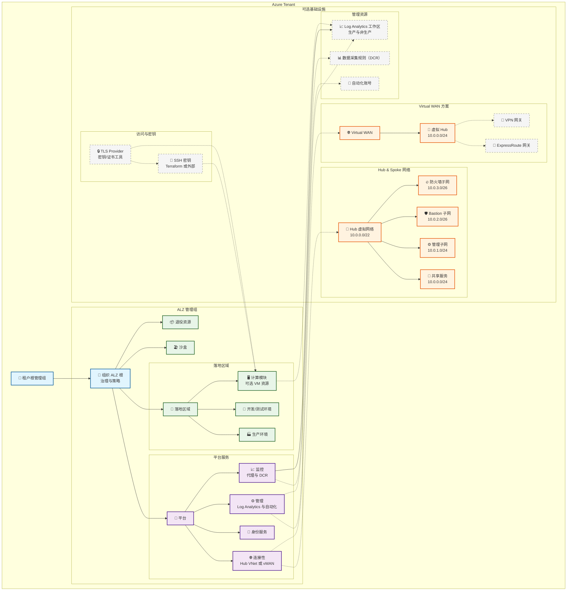

# Azure Landing Zone（ALZ）Terraform 实现（中文）

本项目是基于 Terraform 的生产级 Azure Landing Zone（ALZ）实现，提供灵活的网络架构、核心安全策略，并遵循微软云采用框架（CAF）的最佳实践。

> 英文版请参见 [README.md](README.md)。

## 🔗 快速链接
- RBAC 角色指南（中文）: [AZURE_ROLES_GUIDE.zh-CN.md](AZURE_ROLES_GUIDE.zh-CN.md)
- RBAC Roles Guide (English): [AZURE_ROLES_GUIDE.md](AZURE_ROLES_GUIDE.md)

## 提供的能力
- 管理组层级：完整的 ALZ 管理组结构
- 网络架构选型：Hub & Spoke、Virtual WAN 或无网络
- 安全策略：核心策略（包含标签存在强制与可选的标签值强制），支持审计或强制模式
- 集中式监控：Log Analytics 与数据采集规则
- 成本可控：可选资源按需部署
- 生产就绪：配置简单、可扩展、易维护

## 🔐 通过 Azure Bastion 进行安全的 VM 访问

由于**网络安全策略**阻止了来自互联网的 SSH/RDP，本实现使用 **Azure Bastion** 进行安全的 VM 管理：

### 架构
```
互联网用户
    ↓
Azure 门户 / Azure Bastion 服务
    ↓
Azure Bastion 主机 (10.0.2.0/26)
    ↓
私有 VM（无公网 IP 暴露）
```

### 配置
- `terraform.tfvars` 中 `deploy_azure_bastion = true` 启用 Bastion
- VM 网络安全组规则：
  - ✅ SSH（端口 22）：仅允许来自 Bastion 子网 (10.0.2.0/26)
  - ✅ RDP（端口 3389）：仅允许来自 Bastion 子网 (10.0.2.0/26)
  - ❌ SSH/RDP：阻止来自互联网 (0.0.0.0/0)

### 使用方法：通过 Azure Bastion 访问 VM

**方式 1：Azure 门户（最简单）**
```bash
# 在 Azure 门户中：
1. 导航到 Virtual Machine 资源
2. 点击"连接" → "Bastion"
3. 选择用户名和认证方式（SSH 密钥或密码）
4. 点击"连接" - 浏览器中打开终端
```

**方式 2：Azure CLI（原生 SSH）**
```bash
# 使用 SSH 密钥连接
az network bastion ssh \
  --name "<bastion-name>" \
  --resource-group "<resource-group>" \
  --target-resource-id "<vm-resource-id>" \
  --auth-type "ssh-key" \
  --username "azureuser" \
  --ssh-key "@<private-key-path>"
```

**方式 3：RDP（Windows VM）**
```bash
# 通过 Bastion 启用 RDP 隧道
az network bastion rdp \
  --name "<bastion-name>" \
  --resource-group "<resource-group>" \
  --target-resource-id "<vm-resource-id>" \
  --username "azureuser"

# 然后使用远程桌面连接到 localhost:13389
```

### 优势
- 🔒 VM 无需公网 IP
- 🌐 不暴露于互联网 SSH/RDP 攻击
- 🔑 通过 Azure AD 管理认证
- 📊 通过 Azure Monitor 完整审计访问
- ✅ 符合"阻止来自互联网的 RDP/SSH"策略

## 新增功能
- 计算模块（可选）：
  - 通过 `deploy_compute_resources` 启用
  - 支持 `vm_os_type`、`vm_size` 和公网 IP 配置
- SSH 密钥生成模式：
  - `generate_ssh_key = true` 时由 Terraform 生成密钥
  - 支持外部/本地公钥；提供校验与安全建议（注意私钥在状态文件中的保护）
- Azure Monitor 集成：
  - 启用监控代理与数据采集规则
  - 生产/非生产 Log Analytics 工作区
  - 详见 [AZURE_MONITOR_GUIDE.md](AZURE_MONITOR_GUIDE.md)
- TLS Provider 支持：用于安全密钥与证书相关场景
- 校验工具增强：
  - `validate-alz.sh`：环境与配置基础校验
  - `validate-alz-features.sh`：功能完整性校验（Compute/SSH/Monitor 等）
  - 文档：`VALIDATION_SCRIPT_ASSESSMENT.md`、`VALIDATION_SCRIPTS_GUIDE.md`

## 🏷️ 标签治理（存在与值）

本实现在平台与落地区域管理组范围提供如下标签治理能力：

- **标签存在强制（内置策略）**：在资源组上强制要求 `Environment`、`CostCenter`、`Owner` 标签存在。
- **标签值强制（自定义策略）**：可选地在资源组上强制标签值为指定值。

配置项：
- `policy_enforcement_mode`：`DoNotEnforce`（审计）/ `Default`（强制拒绝）。
- `required_environment_tag`、`required_cost_center_tag`、`required_owner_tag`：用于“标签值强制”的期望值。

计划与应用示例：
```powershell
# 生成计划（已纳入默认基线计划）
terraform plan -out "plans/tag-value-enforce.plan"

# 应用该计划
terraform apply "plans/tag-value-enforce.plan"
```

## 部署内容概览
- 核心：管理组层级、（可选）订阅分配
- 可选：连接性（Hub & Spoke 或 Virtual WAN）、安全策略、管理资源、监控与日志、计算模块（可选）

## 架构总览（中文）



### TLS Provider 位置与作用

- 位置：位于架构的“访问与密钥”分组，与 `SSHKeys` 并列。
- 作用：提供安全的密钥/证书工具能力，用于可选的计算模块与 SSH 密钥工作流。
- 交互关系：
  - 协助 `SSHKeys` 在生成或处理密钥材料时的工具支持
  - 支持 `Compute` 模块在需要 TLS 密钥/证书操作的场景
```

## 快速开始

提示：如需了解 RBAC 模型细节（角色、作用范围与 az CLI 示例），请参阅：
- [AZURE_ROLES_GUIDE.zh-CN.md](AZURE_ROLES_GUIDE.zh-CN.md)
- [AZURE_ROLES_GUIDE.md](AZURE_ROLES_GUIDE.md)
### 1. 先决条件
- Azure CLI 登录并选择管理订阅
- Terraform >= 1.5.0

### 2. 后端配置（Azure Storage 作为 Terraform Backend）
- 推荐使用 `backend.conf` 文件进行配置，或通过 CLI 参数传入
- 支持 Azure AD 认证、Access Key 或 SAS Token

### 3. 环境配置（编辑 `terraform.tfvars`）
- 设置管理组名称、前缀、组织名、位置
- 选择网络架构（`hub_spoke`、`vwan`、`none`）与是否部署连接性
- 设置安全策略模式（`DoNotEnforce` 或 `Default`）与可选资源

### 4. 校验与部署
```bash
./validate-alz.sh              # 基础环境与配置校验
./validate-alz-features.sh     # 功能完整性校验（Compute/SSH/Monitor）
terraform init -backend-config=backend.conf
terraform plan
terraform apply
```

## 监控与合规
- 在 Azure Policy 面板查看合规性，审计模式下先观察再逐步强制
- 集中日志：生产与非生产工作区 + 自动化账号
- 成本管理：标签、命名与可选资源控制

## 🗂️ 基线与计划摘要

使用维护脚本整理并归档计划摘要：

```powershell
# 生成默认基线计划的摘要并自动提交/推送
pwsh -NoProfile scripts/maintain-baselines.ps1

# 默认包含：
# - plans/baseline-policy.plan
# - plans/baseline-network.plan
# - plans/tag-value-enforce.plan
# - plans/baseline-defender.plan
```

输出的摘要文件：
- plans/baseline-policy.changes.md
- plans/baseline-network.changes.md
- plans/tag-value-enforce.changes.md
- plans/baseline-defender.changes.md

### 合规快照（自动归档）

维护脚本结尾会导出合规快照（JSON + Markdown）并自动提交/推送：

```powershell
# 一键维护 + 合规快照
pwsh scripts/maintain-baselines.ps1

# 按需导出（产物保存至 plans/compliance）
pwsh scripts/export-compliance-snapshot.ps1

# 注册每日/每周计划任务（维护 + 快照）
pwsh scripts/setup-maintenance-schedule.ps1 -CreateDaily
pwsh scripts/setup-maintenance-schedule.ps1 -CreateWeekly -WeeklyDay Sunday -WeeklyTime 02:30
```

## 文档与资源
- 英文总览：[README.md](README.md)
- 监控集成指南（中文）：[AZURE_MONITOR_GUIDE.md](AZURE_MONITOR_GUIDE.md)
- Azure Landing Zones 文档：https://docs.microsoft.com/azure/cloud-adoption-framework/ready/landing-zone/
- Azure Policy 文档：https://docs.microsoft.com/azure/governance/policy/
- Hub-Spoke 网络架构：https://docs.microsoft.com/azure/architecture/reference-architectures/hybrid-networking/hub-spoke
- Virtual WAN 文档：https://docs.microsoft.com/azure/virtual-wan/

---

以简洁、可维护为原则构建，适用于生产环境的落地实施。

## 👤 身份验证与首次登录改密（中文）

为确保新增用户的首次登录必须修改初始密码，并避免使用未验证的自定义域导致的“用户名可能不正确”提示，本实现提供以下步骤与脚本：

- 核心结论：当前租户未验证自定义域，`resolved_upn_domain` 为 `gdjiuyun.onmicrosoft.com`；所有新增用户均已设置 `forceChangePasswordNextSignIn = true`。

### 一键检查（Graph API）

使用脚本检查所有用户是否启用首次登录强制改密：

```powershell
pwsh -NoProfile scripts/check-force-password-change.ps1
```

期望输出示例：

```
UPN                                          ForceChangeOnNextSignIn
stduser@gdjiuyun.onmicrosoft.com            True
bingohr-<group>-user@gdjiuyun.onmicrosoft.com True
...
```

### 自定义域覆盖（在完成域验证后）

当您的企业域在 Entra ID 中完成验证后，可在 `terraform.tfvars` 中设置：

```hcl
upn_domain_override = "example.com"
```

随后执行：

```powershell
terraform plan -out tfplan_upn_override
terraform apply tfplan_upn_override
```

注意：若覆盖为未验证域，Azure AD 将返回 400 错误并拒绝更新。

### 首次登录指南

在自定义域验证前，使用下述 UPN 登录 Azure Portal：

- 标准用户：`stduser@gdjiuyun.onmicrosoft.com`
- 组用户：`bingohr-<group>-user@gdjiuyun.onmicrosoft.com`

首次登录将被强制修改初始密码；如需复核，请运行上述检查脚本。

## 👥 组 RBAC 模型与验证（中文）

本实现为各组用户配置了实用的 Azure RBAC 权限，既保证最小权限原则，又满足日常运维需求。具体如下（均在管理组范围保留基础 Reader 能力）：

如需查看完整的角色清单、作用范围、CLI 示例与验证指引，请参阅以下指南：
- [AZURE_ROLES_GUIDE.zh-CN.md](AZURE_ROLES_GUIDE.zh-CN.md)
- [AZURE_ROLES_GUIDE.md](AZURE_ROLES_GUIDE.md)

便笺：VM 登录角色差异
- `Virtual Machine Administrator Login`：支持通过 AAD SSH 登录并具备管理员权限，可执行 `sudo`。
- `Virtual Machine User Login`：不具备管理员权限，无法执行 `sudo`。
- 本实现在生产/非生产 VM 范围统一使用“管理员登录”角色以支持 `sudo`。登录后可用 `sudo -l` 与 `sudo whoami`（期望 `root`）进行快速验证。

- 非生产组（nonprod）：在“非生产工作负载”资源组授予 `Contributor`；对应非生产 VM 上授予 `Virtual Machine Administrator Login`。
- 生产组（prod）：在“生产工作负载”资源组授予 `Contributor`；对应生产 VM 上授予 `Virtual Machine Administrator Login`。
- 连接性组（connectivity）：在“连接性”资源组授予 `Reader`。
- 管理组（management）：在“可选资源/管理资源”资源组授予 `Reader`。
- 身份组（identity）：在“可选资源/管理资源”资源组授予 `Reader`。
- 沙盒组（sandboxes）：在“生产/非生产工作负载”两个资源组授予 `Reader`。
- 退役组（decommissioned）：在“可选资源/管理资源”资源组授予 `Reader`。

实现位置：见 [main.tf](main.tf) 中 `local.alz_group_extra_rbac` 与相关 `module "iam_group_users"` 配置；调试输出参见 [outputs.tf](outputs.tf) 中 `alz_group_user_upns`、`resolved_upn_domain` 等。

### 验证步骤（Azure Portal）
- 进入目标资源组 → 访问控制 (IAM) → 角色分配 → 按用户或角色筛选，确认是否存在上表对应的 `Reader`/`Contributor`/`Virtual Machine Administrator Login`。

### 验证步骤（Azure CLI）
使用示例变量（请替换为实际 UPN、资源组与 VM 名称）：

```powershell
$upn   = "bingohr-nonprod-user@gdjiuyun.onmicrosoft.com"   # 任一组用户 UPN
$rg    = "<your-nonprod-workload-rg>"                       # 例如：bingohr-nonprod-rg
$vm    = "<your-nonprod-vm-name>"                           # 例如：bingohr-nonprod-web

$oid   = az ad user show --id $upn --query id -o tsv
$rgId  = az group show -n $rg --query id -o tsv
$vmId  = az vm show -g $rg -n $vm --query id -o tsv

# 资源组范围的角色（Reader 或 Contributor）
az role assignment list --assignee $oid --scope $rgId -o table

# VM 范围的登录角色（Virtual Machine Administrator Login）
az role assignment list --assignee $oid --scope $vmId -o table
```

结果应能看到：
- 非生产/生产组用户在对应工作负载 RG 拥有 `Contributor`。
- 非生产/生产组用户在对应 VM 上拥有 `Virtual Machine Administrator Login`。

注意：在通过 AAD SSH 登录到 VM 后，使用 `sudo` 需要 `Virtual Machine Administrator Login` 角色。快速验证：
- 使用 AAD SSH 登录：`ssh -o PreferredAuthentications=gssapi-with-mic -l <your_upn> <vm_public_ip>`
- 验证提权：执行 `sudo -l` 与 `sudo whoami`（应返回 `root`）。
- 其余各组在相应 RG 拥有 `Reader`。

如需调整权限，请在 [main.tf](main.tf) 的 `local.alz_group_extra_rbac` 中按需增删对应条目后执行 `terraform plan && terraform apply`。

